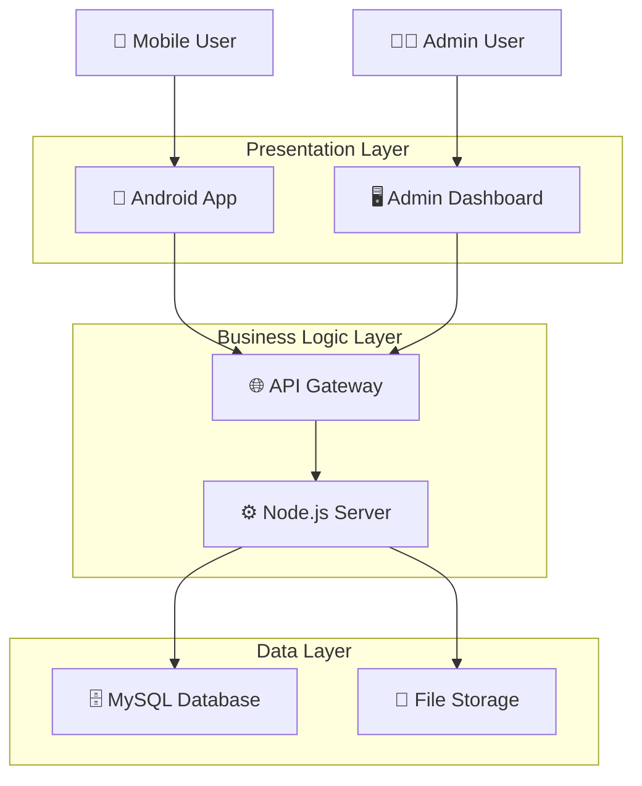

```markdown
# 🏗️ NagarSetu (CivicLink) - Full Stack Civic Issue Reporting System

<div align="center">


**A Comprehensive Three-Tier Architecture for Civic Governance**

</div>

## 📋 Table of Contents

- [🚀 Overview](#-overview)
- [🎯 Core Features](#-core-features)
- [🏗️ System Architecture](#️-system-architecture)
- [🛠️ Tech Stack](#️-tech-stack)
- [📱 Frontend (Android)](#-frontend-android)
- [⚙️ Backend (Node.js API)](#️-backend-nodejs-api)
- [🗄️ Database Schema](#️-database-schema)
- [🔗 API Documentation](#-api-documentation)
- [🚀 Deployment](#-deployment)
- [📁 Project Structure](#-project-structure)
- [🤝 Contributing](#-contributing)

## 🚀 Overview

NagarSetu (formerly CivicLink) is a **complete, production-ready, full-stack application** engineered from the ground up for the **SIH 2025 Hackathon**. This sophisticated system implements a **real-time, three-tier architecture** (Android App → Node.js API → MySQL Database) that revolutionizes civic issue reporting and resolution workflows.

> 🎯 **Key Achievement**: This is not merely a UI prototype but a **fully functional, data-driven application** with complete CRUD operations, real-time updates, and secure authentication mechanisms.

## 🎯 Core Features

### 📱 Native Android Application

| Module | Features | Technologies |
|--------|----------|--------------|
| **Authentication** | Multi-language support (EN, HI, BN), Email/Password & Phone OTP login, Secure session management | `Retrofit`, `SharedPreferences`, `Firebase Auth` |
| **Dashboard** | Dynamic home feed, Real-time issue filtering, "My Reports" section, Status-based categorization | `RecyclerView`, `CardView`, `LiveData` |
| **Mapping System** | Interactive maps with custom markers, GPS location tracking, Bottom sheet details, Status-based color coding | `Google Maps SDK`, `FusedLocationProvider`, `BottomSheetBehavior` |
| **Issue Reporting** | Multi-category selection, GPS auto-location, Image upload with compression, Form validation | `Camera/Gallery API`, `Location Services`, `Multipart Upload` |
| **User Management** | Secure profile editing, Password verification flow, Smart email addition for phone users | `BCrypt`, `Data Validation`, `Secure Storage` |
| **Notifications** | Real-time alerts, Deep linking, Vibration feedback, Status update notifications | `NotificationManager`, `PendingIntent`, `Vibration` |

### 🖥️ Admin Dashboard

| Feature | Description | Implementation |
|---------|-------------|----------------|
| **Issue Management** | Comprehensive issue listing with filters, Bulk actions, Priority assignment | `DataTables`, `REST API`, `Real-time Updates` |
| **Worker Assignment** | Dynamic worker allocation, Capacity monitoring, Assignment history | `Dropdown Binding`, `AJAX Updates`, `Status Tracking` |
| **Media Handling** | Image preview and management, Upload validation, Storage optimization | `Multer`, `Express Static`, `Image Compression` |
| **Analytics** | Basic reporting, Status distribution, Resolution metrics | `Chart.js`, `Data Aggregation`, `Export Functions` |

## 🏗️ System Architecture



## 🛠️ Tech Stack

### 📱 Frontend (Android)
```xml
<!-- Core Technologies -->
- Language: Java 11
- UI Framework: Android XML Layouts
- Architecture: MVC Pattern
- Minimum SDK: API 21 (Android 5.0)

<!-- Key Dependencies -->
- Networking: Retrofit 2.9.0 + GSON
- Image Handling: Glide/Picasso
- Maps: Google Maps SDK
- Location: FusedLocationProviderClient
- Security: Android Keystore System
```

### ⚙️ Backend (Node.js)
```javascript
// Server Configuration
{
  "runtime": "Node.js 18+",
  "framework": "Express.js 4.18+",
  "authentication": "JWT + BCrypt",
  "file_handling": "Multer",
  "security": "Helmet + CORS",
  "database": "MySQL2 Promise Wrapper"
}
```

### 🗄️ Database (MySQL)
```sql
-- Database Specifications
- Engine: InnoDB
- Character Set: utf8mb4
- Collation: utf8mb4_unicode_ci
- Relations: Foreign Key Constraints
- Indexing: Optimized Query Performance
```

## 📱 Frontend (Android)

### 🏗️ Application Structure
```
app/
├── src/main/java/com/nagarsetu/
│   ├── auth/                    # Authentication module
│   │   ├── LoginActivity.java
│   │   ├── SignupActivity.java
│   │   └── OTPVerificationActivity.java
│   ├── dashboard/              # Main application flow
│   │   ├── MainActivity.java
│   │   ├── HomeFragment.java
│   │   └── MyReportsFragment.java
│   ├── maps/                   # Mapping functionality
│   │   ├── MapActivity.java
│   │   └── LocationService.java
│   ├── issues/                 # Issue management
│   │   ├── ReportIssueActivity.java
│   │   └── IssueDetailActivity.java
│   ├── profile/               # User management
│   │   ├── ProfileActivity.java
│   │   └── EditProfileActivity.java
│   ├── network/               # API communication
│   │   ├── ApiClient.java
│   │   ├── ApiService.java
│   │   └── models/           # Data models
│   └── utils/                # Utilities
│       ├── SessionManager.java
│       ├── ImageUtils.java
│       └── NotificationHelper.java
```

### 🔧 Key Implementation Details

#### ApiClient.java - Network Management
```java
public class ApiClient {
    private static final String BASE_URL = "https://your-server.devtunnels.ms/api/";
    private static Retrofit retrofit = null;
    
    public static Retrofit getClient() {
        if (retrofit == null) {
            OkHttpClient okHttpClient = new OkHttpClient.Builder()
                .readTimeout(60, TimeUnit.SECONDS)
                .connectTimeout(60, TimeUnit.SECONDS)
                .build();
                
            retrofit = new Retrofit.Builder()
                .baseUrl(BASE_URL)
                .client(okHttpClient)
                .addConverterFactory(GsonConverterFactory.create())
                .build();
        }
        return retrofit;
    }
}
```

## ⚙️ Backend (Node.js API)

### 🗂️ Server Structure
```
server/
├── config/
│   ├── database.js            # DB configuration
│   └── multer-config.js      # File upload setup
├── controllers/
│   ├── authController.js     # Authentication logic
│   ├── issueController.js    # Issue management
│   └── adminController.js    # Admin operations
├── middleware/
│   ├── auth.js              # JWT verification
│   ├── upload.js            # File handling
│   └── validation.js        # Input validation
├── models/
│   ├── User.js              # User schema
│   ├── Issue.js             # Issue schema
│   └── Worker.js            # Worker schema
├── routes/
│   ├── auth.js              # Auth endpoints
│   ├── issues.js            # Issue endpoints
│   └── admin.js             # Admin endpoints
└── uploads/                 # File storage
    └── issues/              # Issue images
```

### 🔌 Core Server Configuration
```javascript
// server.js - Main application setup
const express = require('express');
const cors = require('cors');
const helmet = require('helmet');
const path = require('path');

const app = express();

// Security middleware
app.use(helmet());
app.use(cors({
    origin: ['http://localhost:3000', 'https://*.devtunnels.ms'],
    credentials: true
}));

// Body parsing middleware
app.use(express.json({ limit: '10mb' }));
app.use(express.urlencoded({ extended: true }));

// Static file serving
app.use('/uploads', express.static(path.join(__dirname, 'uploads')));

// API routes
app.use('/api/auth', require('./routes/auth'));
app.use('/api/issues', require('./routes/issues'));
app.use('/api/admin', require('./routes/admin'));

// Admin dashboard
app.get('/admin', (req, res) => {
    res.sendFile(path.join(__dirname, 'public', 'admin.html'));
});

module.exports = app;
```

## 🗄️ Database Schema

### 📊 Entity Relationship Diagram

```sql
-- Users Table
CREATE TABLE users (
    id VARCHAR(36) PRIMARY KEY DEFAULT UUID(),
    email VARCHAR(255) UNIQUE,
    phone VARCHAR(15) UNIQUE,
    password_hash VARCHAR(255),
    full_name VARCHAR(255) NOT NULL,
    created_at TIMESTAMP DEFAULT CURRENT_TIMESTAMP,
    updated_at TIMESTAMP DEFAULT CURRENT_TIMESTAMP ON UPDATE CURRENT_TIMESTAMP,
    INDEX idx_email (email),
    INDEX idx_phone (phone)
);

-- Issues Table
CREATE TABLE issues (
    id VARCHAR(36) PRIMARY KEY DEFAULT UUID(),
    title VARCHAR(255) NOT NULL,
    description TEXT,
    category ENUM('water', 'electricity', 'roads', 'sanitation', 'other'),
    status ENUM('pending', 'in_progress', 'resolved') DEFAULT 'pending',
    priority ENUM('low', 'medium', 'high') DEFAULT 'medium',
    latitude DECIMAL(10, 8) NOT NULL,
    longitude DECIMAL(11, 8) NOT NULL,
    image_url VARCHAR(500),
    reported_by VARCHAR(36) NOT NULL,
    assigned_to VARCHAR(36),
    created_at TIMESTAMP DEFAULT CURRENT_TIMESTAMP,
    updated_at TIMESTAMP DEFAULT CURRENT_TIMESTAMP ON UPDATE CURRENT_TIMESTAMP,
    FOREIGN KEY (reported_by) REFERENCES users(id),
    FOREIGN KEY (assigned_to) REFERENCES workers(id),
    INDEX idx_status (status),
    INDEX idx_category (category),
    INDEX idx_reported_by (reported_by)
);

-- Workers Table
CREATE TABLE workers (
    id VARCHAR(36) PRIMARY KEY DEFAULT UUID(),
    name VARCHAR(255) NOT NULL,
    department ENUM('water', 'electricity', 'roads', 'sanitation'),
    phone VARCHAR(15) NOT NULL,
    email VARCHAR(255),
    is_active BOOLEAN DEFAULT TRUE,
    created_at TIMESTAMP DEFAULT CURRENT_TIMESTAMP
);
```

## 🔗 API Documentation

### 🔐 Authentication Endpoints

| Method | Endpoint | Description | Request Body |
|--------|----------|-------------|--------------|
| `POST` | `/api/auth/register` | User registration | `{email, password, fullName}` |
| `POST` | `/api/auth/login` | Email login | `{email, password}` |
| `POST` | `/api/auth/send-otp` | OTP generation | `{phoneNumber}` |
| `POST` | `/api/auth/verify-otp/login` | Phone login | `{phoneNumber, otp}` |
| `POST` | `/api/auth/verify-otp/signup` | Phone registration | `{phoneNumber, otp, fullName}` |
| `GET` | `/api/auth/user/:userId` | Get user profile | - |
| `PUT` | `/api/auth/user/:userId` | Update profile | `{currentPassword?, newPassword?, email?}` |

### 📋 Issues Endpoints

| Method | Endpoint | Description | Content-Type |
|--------|----------|-------------|--------------|
| `POST` | `/api/issues` | Create new issue | `multipart/form-data` |
| `GET` | `/api/issues` | Get all issues | - |
| `GET` | `/api/issues/user/:userId` | Get user's issues | - |

### 👨‍💼 Admin Endpoints

| Method | Endpoint | Description | Request Body |
|--------|----------|-------------|--------------|
| `GET` | `/api/admin/workers` | Get all workers | - |
| `PUT` | `/api/admin/issue/:issueId` | Update issue | `{status, priority, assignedTo}` |

## 🚀 Deployment

### 📡 Development Tunnel Setup

```bash
# 1. Start Node.js server
npm start

# 2. Enable VS Code Dev Tunnels
# - Open VS Code Command Palette (Ctrl+Shift+P)
# - Select "Ports: Focus on Ports View"
# - Add port 3000 and set visibility to Public

# 3. Update Android app configuration
# - Update BASE_URL in ApiClient.java
# - Configure network_security_config.xml for devtunnels.ms
```

### 🔒 Network Security Configuration

```xml
<!-- app/src/main/res/xml/network_security_config.xml -->
<network-security-config>
    <domain-config cleartextTrafficPermitted="true">
        <domain includeSubdomains="true">your-server.devtunnels.ms</domain>
    </domain-config>
</network-security-config>
```

### 🐳 Docker Deployment (Optional)

```dockerfile
# Dockerfile for production
FROM node:18-alpine
WORKDIR /app
COPY package*.json ./
RUN npm ci --only=production
COPY . .
EXPOSE 3000
CMD ["npm", "start"]
```

## 📁 Project Structure

```
nagarsetu/
├── 📱 android-app/           # Android Studio Project
│   ├── app/
│   │   ├── src/main/
│   │   │   ├── java/com/nagarsetu/
│   │   │   └── res/
│   │   └── build.gradle
│   └── gradle.properties
├── ⚙️ server/                # Node.js Backend
│   ├── controllers/
│   ├── models/
│   ├── routes/
│   ├── uploads/
│   └── package.json
├── 🗄️ database/             # SQL Scripts & Migrations
│   ├── schema.sql
│   └── seed-data.sql
├── 📚 docs/                 # Documentation
│   ├── API.md
│   └── SETUP.md
└── 🔧 config/               # Configuration Files
    ├── android/
    └── server/
```

## 🤝 Contributing

We welcome contributions to NagarSetu! Please read our contributing guidelines before submitting pull requests.

### 🐛 Issue Reporting
1. Use the GitHub Issues template
2. Provide detailed reproduction steps
3. Include relevant logs and screenshots

### 🔀 Pull Request Process
1. Fork the repository
2. Create a feature branch (`git checkout -b feature/amazing-feature`)
3. Commit your changes (`git commit -m 'Add amazing feature'`)
4. Push to the branch (`git push origin feature/amazing-feature`)
5. Open a Pull Request

---

<div align="center">

**Built with ❤️ for SIH 2025**

*Transforming Civic Engagement Through Technology*

</div>
```
